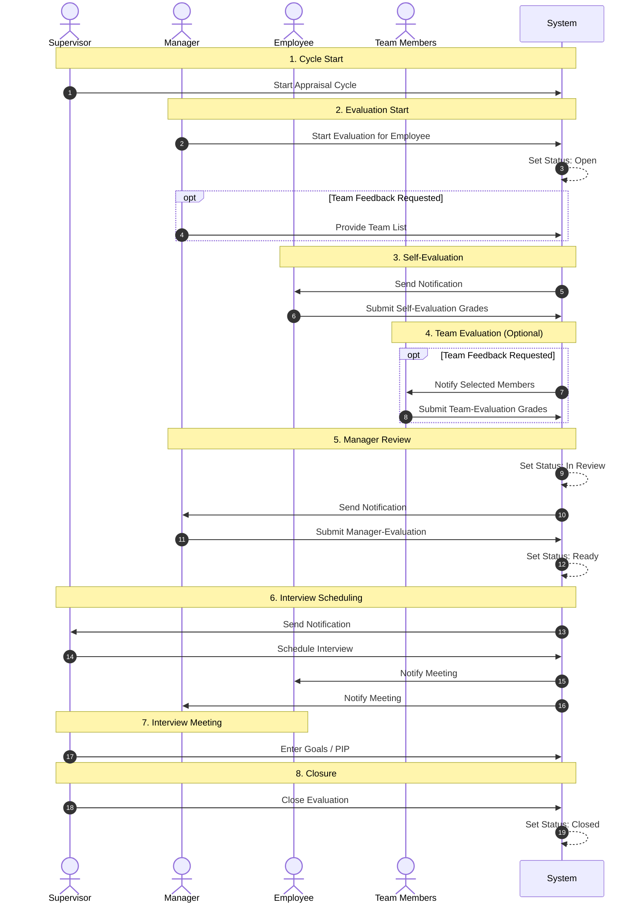

# Competence

Specialized software for managing and monitoring of a **Competence-based Performance Apprisal Process** within an organization.

## Information

This is a customizable solution based on the **ti-engine** framework. Currently under development.

## Processes

### Performance Appraisal

The recurring performance appraisal process governs the completion and submission of a digital `Evaluation` form by an `Employee` of the organization, a follow-up review and update by an authorized `Manager`, followed by an official closure by the process governing body, which will be labeled as the `Supervisor` (this is usually the HR department head or the process owner).

#### Default Process Workflow

1. A new `Performance Appraisal Cycle` is started by the `Supervisor`. The cycle gets a unique ID assigned to it as well as an official starting date. Both attributes are integral part of the `Evaluations`.
2. A new `Evaluation` is started for an `Employee` by an authorized `Manager`. This is either the direct manager, the department head, or someone responsible for that employee based on the configured `Organizational Chart`. The `Evaluation` receives a status `Open` and a set of `Competences` based on the employee's `Position` and `Level` according to the system configuration. Additionally, the `Manager` can request team-evaluation feedback for that `Employee` - for this they need to enter a set of employee names that have worked with the `Employee` in the period since the previous performance appraisal.
3. The `Employee` receives a notification in the system (additionally, an email or a messenger memo depending on the configuration). They are required to fill in the self-evaluation `Grades` in the `Evaluation` form for all `Competences` up until a specified date. Once ready, they need to submit the form as completed by them.
4. If team-evaluation was requested, the system will randomly pick a number of employees from the list provided by the `Manager`. That number depends on the system configuration (by default `3`). Each of the selected employees receives a notification in the system and has to fill a team-evaluation `Grades` for the `Employee` in question. The team members do not see the grading done by anyone else. They need to finish the team-evaluation up until a specified date and submit the form as completed. The final team-evaluation `Grades` are calculated based on the feedback from all submitted forms.
5. Once the self-evaluation and team-evaluation are completed (or the deadline has expired), the system set the `Evaluation` status to `In Review`. The `Manager` receives a notification that they need to complete the manager-evaluation of that `Employee` up until a specified date. They can see all submitted `Grades` and feedback in the `Evaluation` form. Once they are done and submit the manager-evaluation feedback, the system changes the status to `Ready`.
6. The `Supervisor` receives a notification that the `Evaluation` for that `Employee` is ready to be reviewed and discussed in a formal interview meeting. They can schedule that via the system using the current `Performance Appraisal Cycle` calendar. The meeting automatically includes the `Employee`, the `Manager`, and the `Supervisor`. Additionally, the `Supervisor` can include more participants if they deem it necessary. All meeting participants receive a notification. The `Evaluation` receives its `Interview Date` based on the scheduled event. The meeting can be rescheduled if necessary.
7. During the interview meeting the `Supervisor` and/or `Manager` can enter additional feedback into the `Evaluation` form but cannot change the previously submitted `Grades` and feedback. They can set concrete goals in the form of up to `5` (configurable) `Competences` for the `Employee` for the period until the next performance appraisal. If necessary, they can also add a formal `Performance Improvement Plan` for the `Employee`.
8. Once the interview meeting is concluded, the `Supervisor` needs to formally close the `Evaluation`. It receives the status `Closed` and no further modifications can be made to it.

#### Default Process Diagram

