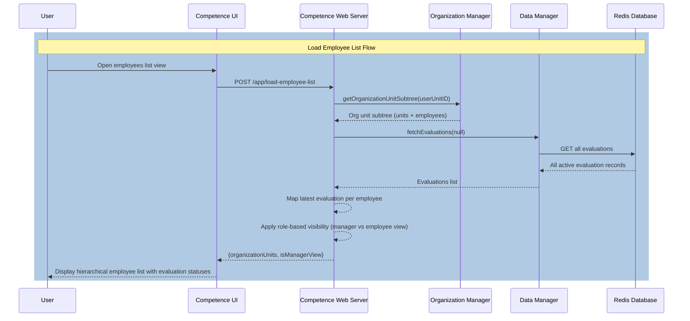
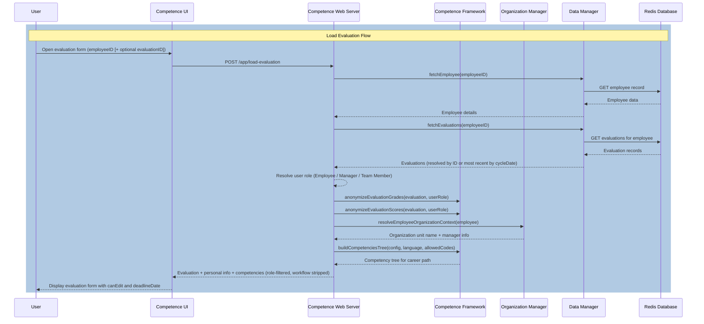
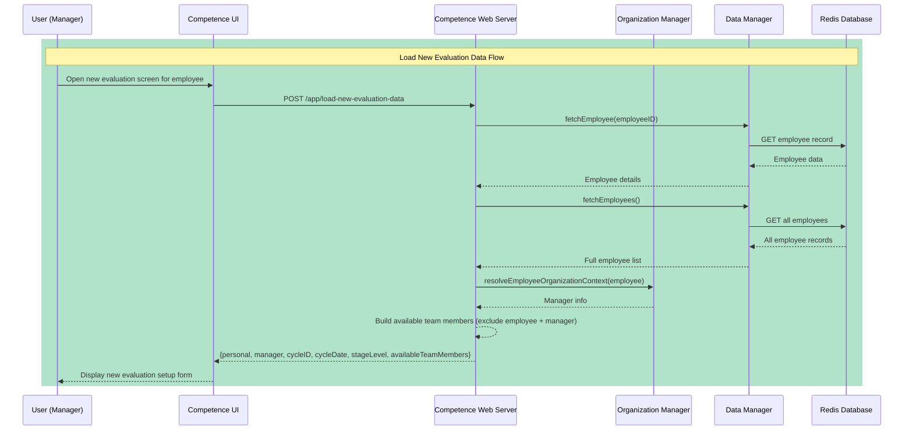
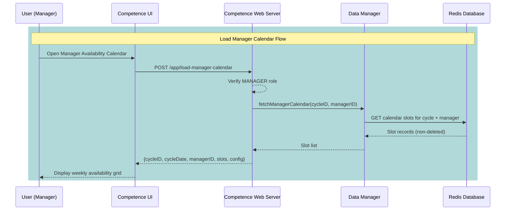
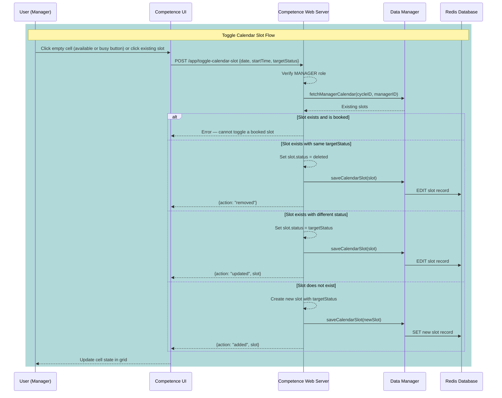

# Competence

Specialized software for managing and monitoring a **Competence-based Performance Appraisal Process** within an organization. Built on the [ti-engine](https://github.com/Belleal/ti-engine) framework.

## Overview

The application supports a structured annual or semi-annual performance appraisal cycle where each employee is evaluated across a set of competencies relevant to their career path and level. Evaluations are conducted collaboratively: the employee completes a self-assessment, selected team members provide peer feedback, and the direct manager reviews all input and adds their own assessment. The result is a weighted performance score across multiple competency categories, interpreted against defined performance thresholds.

## Current Status

The following features are currently implemented:

- **[Process]** Starting evaluations by an authorized Manager or Supervisor, with the competency set determined by the employee's career path and appraisal cycle
- **[Process]** Loading evaluations by Employee, Team Member, or Manager — with role-based data visibility and edit authorization
- **[Process]** Saving evaluation drafts (Employee for self-grades; Manager for manager-grades and comment)
- **[Process]** Submitting evaluations with role-based validation, deadline enforcement, and automatic status transitions
- **[Process]** Collective team evaluation mode — team members grade by competency subcategory, applied uniformly to all competencies within that subcategory
- **[Process]** Automatic performance score calculation upon manager submission, across all competency categories and as a combined final score
- **[Process]** Manager availability calendar — Managers define interview availability by toggling time slots as `available` or `busy` on a configurable weekly grid
- **[Process]** Interview scheduling — Supervisors book available slots for `READY` evaluations; booking sets `evaluation.interviewDate` and links the slot to the evaluation; cancellation reverses both
- **[Data]** Employee data management and retrieval from Redis
- **[Data]** Evaluation persistence in Redis with full workflow state tracking
- **[Data]** Calendar slot persistence in Redis with `available`, `booked`, `busy`, and `deleted` (logical) states
- **[UI]** Employees List screen — hierarchical organization chart view with role-aware data and evaluation status
- **[UI]** Evaluation Form screen — role-specific grading interface with deadline and submit-state awareness
- **[UI]** New Evaluation screen — form for starting a new evaluation with optional team member selection
- **[UI]** Manager Availability Calendar screen — weekly grid for toggling availability slots, cycle-bounded navigation
- **[UI]** Interview Schedule screen — evaluation list with schedule/cancel actions and a 4-column weekly slot picker

> **Note on planned features:** Step 8 of the process (goal-setting and formal closure) is part of the full intended workflow and is described below, but is not yet implemented. The appraisal cycle ID and date will be configurable by Supervisors in a planned future release; they are currently hardcoded in the application.

---

## Core Concepts

### Roles

The system defines four roles that govern what actions a user can take and what data they can see:

| Role        | Code | Description                                                                                                                                                 |
|-------------|------|-------------------------------------------------------------------------------------------------------------------------------------------------------------|
| Employee    | `1`  | The subject of the evaluation. Submits self-assessment grades and a written comment.                                                                        |
| Manager     | `2`  | Responsible for managing employees in their organizational hierarchy. Can start, draft, and submit manager-grade evaluations.                               |
| Supervisor  | `3`  | Process owner (typically the HR department head). Can start evaluations for any employee. Schedules interviews and formally closes evaluations *(planned)*. |
| Team Member | `4`  | A peer who provides feedback on behalf of the team for a specific evaluation.                                                                               |

A user can hold multiple roles. The active role for a given operation is resolved from context: being the employee of record, appearing in the `workflow.team` list, or being the resolved manager in the organization hierarchy.

### Career Paths

Each employee is assigned a **career path** that determines which competencies appear in their evaluation:

| Code   | Name              |
|--------|-------------------|
| `SE01` | Software Engineer |
| `PM01` | Project Manager   |
| `BA01` | Business Analyst  |

Additional career paths and their competency mappings are configurable in `bin/config/config.career-path-competencies.json`.

### Career Path Levels

Employees progress through a sequence of **levels**, each with one or more **stages**. The combination of level and stage (e.g., `J2`, `S3`) is called the **stage-level** and determines the relevancy weight applied to each competency in score calculations.

| Level             | Code | Stages | Stage-Levels | Description                                              |
|-------------------|------|--------|--------------|----------------------------------------------------------|
| Intern            | `N`  | 1      | N1           | Entry-level; works under supervision                     |
| Junior Specialist | `J`  | 3      | J1, J2, J3   | Limited experience; handles basic tasks independently    |
| Specialist        | `R`  | 3      | R1, R2, R3   | Experienced; works independently across most tasks       |
| Senior Specialist | `S`  | 3      | S1, S2, S3   | Highly experienced; can lead and coach junior colleagues |
| Expert            | `X`  | 1      | X1           | Expert individual contributor track (promoted from S)    |
| Manager           | `T`  | 1      | T1           | Management track (promoted from S)                       |

At the Senior Specialist level, employees can advance either to Expert (`X`) or Manager (`T`), representing two distinct career directions.

### Competency Framework

Competencies are organized into a three-level hierarchy: **Category → Subcategory → Competency**. All competency names, descriptions, and per-level relevancy weights are fully configurable via JSON configuration files and are localized (currently English and Bulgarian).

The default framework defines three top-level categories and nine subcategories:

| Category       | Code | Subcategory           | Subcategory Code | Description                                           |
|----------------|------|-----------------------|------------------|-------------------------------------------------------|
| **Expertise**  | `E`  | Theoretical Knowledge | `E1`             | Core concepts, principles, and domain theory          |
|                |      | Applied Skills        | `E2`             | Technical abilities applied to real tasks             |
|                |      | Practical Experience  | `E3`             | Cumulative hands-on professional experience           |
| **Insight**    | `I`  | Processes             | `I1`             | Adherence to organizational workflows and standards   |
|                |      | Planning              | `I2`             | Personal workflow and time management                 |
|                |      | Estimation            | `I3`             | Task and resource estimation accuracy                 |
| **Commitment** | `C`  | Responsibility        | `C1`             | Work ethics, professional development, best practices |
|                |      | Communication         | `C2`             | Professional communication at all levels              |
|                |      | Mentorship            | `C3`             | Knowledge sharing and colleague support               |

Each competency also carries a **scope** description per level (N/J/R/S/X/T), describing what mastery at that level looks like — used as guidance for graders, not in scoring.

### Evaluation Grades

Each competency in an evaluation receives up to three grades: one from the employee (self), one aggregated from team members (team cumulative), and one from the manager. The possible grade values and their numeric weights used in score calculations are:

| Grade | Name           | Weight | Meaning                                                        |
|-------|----------------|--------|----------------------------------------------------------------|
| `S`   | Superior       | 1.3    | Performance significantly exceeds expectations at this level   |
| `R`   | Regular        | 1.0    | Performance meets expectations at this level                   |
| `U`   | Unsatisfactory | 0.6    | Performance falls short of expectations at this level          |
| `N`   | Not Utilized   | 0.0    | Competency is not applicable or not demonstrated at this level |

Grade weights are configurable in `bin/config/config.application.json`.

### Performance Scores and Thresholds

Once the manager submits their evaluation, the system calculates a performance score for each competency category and a combined final score. Scores are interpreted against five performance thresholds:

| Threshold    | Code | Score Range | Interpretation                                                                          |
|--------------|------|-------------|-----------------------------------------------------------------------------------------|
| Weak         | `T1` | ≤ 76        | Performance is significantly below expectations. A formal improvement plan is required. |
| Insufficient | `T2` | ≤ 89        | Performance is below standard. Active guidance from the manager is needed.              |
| Expected     | `T3` | ≤ 105       | Performance meets standard expectations for the current level.                          |
| Good         | `T4` | ≤ 119       | Performance exceeds expectations. Eligible for a bonus or formal recognition.           |
| Outstanding  | `T5` | ≤ 150       | Performance consistently exceeds expectations. Promotion is strongly recommended.       |

Thresholds are configurable in `bin/config/config.application.json`.

---

## Performance Appraisal Process

### Evaluation Status Lifecycle

Evaluations move through a defined sequence of statuses driven by submission events:

```
NOT_STARTED ──► OPEN ──► IN_REVIEW ──► READY ──► CLOSED*
                  │
                  └──► DELETED  (available from any active status)
```

> `*` CLOSED status transitions are planned; currently the maximum implemented status is `READY`.

Status transitions are triggered by specific actions (submissions), not by deadlines. Automatic deadline-based transitions are planned for a future release.

### Detailed Process Steps

#### Step 1 — Appraisal Cycle Start *(planned)*

A new **Performance Appraisal Cycle** is started by the `Supervisor`. The cycle receives a unique ID (e.g., `2026-H1`) and an official closing date. All evaluations opened within this cycle reference both values. A configuration UI for Supervisors to initiate cycles is planned; the cycle ID and date are currently hardcoded.

#### Step 2 — Evaluation Start

An authorized `Manager` (or `Supervisor`) starts a new `Evaluation` for an `Employee`. The system verifies no active evaluation exists for that employee (i.e., no evaluation in `Open`, `In Review`, or `Ready` status) before proceeding.

The new evaluation is created with:

- Status: `Open`
- A set of competencies determined by the employee's career path and the current cycle ID
- The employee's resolved manager ID, derived from the organization chart
- An optional list of team member IDs to provide peer feedback

#### Step 3 — Self-Evaluation

The `Employee` receives a notification and fills in self-assessment grades for all competencies. They may also add a written comment. Grades can be saved as a **draft** at any point until the submission deadline. Once all competencies have been graded, the employee submits the form (`selfEvaluationCompleted = true`).

#### Step 4 — Team Evaluation *(optional)*

If team members were assigned in Step 2, each receives a notification and must submit feedback before a deadline.

Behavior depends on the `isTeamEvaluationCollective` setting (default: `true`):

- **Collective mode** (`true`): Team members grade by *subcategory* (e.g., a single grade covering all competencies in E1). The submitted subcategory grade is automatically applied to every individual competency within that subcategory.
- **Individual mode** (`false`): Team members grade each competency independently.

Each team member can submit only once. When all assigned team members have submitted, the system calculates a **cumulative team grade** per competency by averaging the individual grades and rounding to the nearest grade value.

#### Step 5 — Status Transition: Open → In Review

The evaluation status changes automatically to `In Review` when *both* of the following are true:

- The employee has submitted their self-evaluation
- The team evaluation is either fully complete or was not requested

The `Manager` receives a notification that the evaluation is ready for their review.

#### Step 6 — Manager Review

The `Manager` reviews all submitted grades (self and aggregated team). They may save drafts of manager-grades and a written manager comment. Once all competencies have been graded by the manager and the form is submitted:

- Manager grades and comment are recorded
- The system calculates the final performance scores across all categories (see [Scoring Algorithm](#scoring-algorithm) below)
- Evaluation status changes to `Ready`

The `Supervisor` receives a notification that the evaluation is ready.

#### Step 7 — Interview Scheduling

Before scheduling can happen, each `Manager` defines their own availability for the current cycle on the **Manager Availability Calendar**. Each slot on the weekly grid can be toggled to one of three states:

| State       | Colour | Meaning                                                                             |
|-------------|--------|-------------------------------------------------------------------------------------|
| `available` | Green  | The manager is free during this slot; Supervisors may book it                       |
| `busy`      | Amber  | The manager is explicitly unavailable; the slot is visible but cannot be booked     |
| `booked`    | Blue   | An interview has been scheduled in this slot; the manager cannot remove it directly |

Slot IDs are deterministic (`cycleID|managerID|date|startTime`) so toggling is idempotent and requires no prior read — clicking the same cell again removes the slot.

Once manager calendars are populated, the `Supervisor` opens the **Interview Schedule** screen. They select a `Ready` evaluation and choose a slot from the 4-column weekly availability grid (grouped by week, showing manager name per slot). Booking a slot:

- Sets `slot.status = "booked"` and attaches a `booking` record (`evaluationID`, `employeeID`, `employeeName`, `bookedAt`)
- Sets `evaluation.interviewDate` to the slot's date

The `Supervisor` may cancel a booking at any time, which restores `slot.status = "available"`, clears the `booking` record, and removes `evaluation.interviewDate`.

#### Step 8 — Interview Meeting and Closure *(planned)*

During the meeting, the `Supervisor` and/or `Manager` may add written feedback to the evaluation. They set concrete goals (up to the configured maximum, default 5) for the employee for the next appraisal period. A formal **Performance Improvement Plan** may also be attached if needed. Previously submitted grades cannot be changed.

Once the meeting is concluded, the `Supervisor` formally closes the evaluation. Status changes to `Closed` and no further modifications are possible.

### Process Sequence Diagram

```mermaid
sequenceDiagram
    autonumber
    actor Sup as Supervisor
    actor Mgr as Manager
    actor Emp as Employee
    actor Team as Team Members
    participant Sys as System

    rect rgba(180, 180, 180, 0.2)
        Note over Sup, Sys: Step 1 — Appraisal Cycle (planned)
        Sup ->> Sys: Configure and start appraisal cycle
        Sys -->> Sys: Record cycle ID and closing date
    end

    Note over Mgr, Sys: Step 2 — Evaluation Start
    Mgr ->> Sys: Start Evaluation for Employee
    Sys -->> Sys: Verify no active evaluation exists
    Sys -->> Sys: Create Evaluation (status: Open)
    Sys -->> Sys: Populate competencies by career path + cycle
    Sys -->> Sys: Resolve and record manager from org chart
    opt Team feedback requested
        Mgr ->> Sys: Provide team member list
    end

    Note over Emp, Sys: Step 3 — Self-Evaluation
    Sys ->> Emp: Send notification
    loop Until submitted or deadline
        Emp ->> Sys: Save draft (grades + comment)
    end
    Emp ->> Sys: Submit self-evaluation
    Sys -->> Sys: selfEvaluationCompleted = true
    Note over Team, Sys: Step 4 — Team Evaluation (optional)
    opt Team members assigned
        Sys ->> Team: Notify assigned team members
        alt Collective mode (default: isTeamEvaluationCollective = true)
            Team ->> Sys: Submit grades by subcategory
            Sys -->> Sys: Map subcategory grade to each competency
        else Individual mode
            Team ->> Sys: Submit grade per competency
        end
        Sys -->> Sys: Remove member from pending list
        opt Last team member submitted
            Sys -->> Sys: Calculate cumulative team grades per competency
            Sys -->> Sys: teamEvaluationCompleted = true
        end
    end

    Note over Sys: Step 5 — Status Transition
    Note right of Sys: Triggers when selfEvaluationCompleted AND teamDone
    Sys -->> Sys: Set status: In Review
    Sys ->> Mgr: Send notification
    Note over Mgr, Sys: Step 6 — Manager Review
    loop Until submitted or deadline
        Mgr ->> Sys: Save draft (manager grades + comment)
    end
    Mgr ->> Sys: Submit manager evaluation
    Sys -->> Sys: managerEvaluationCompleted = true
    Sys -->> Sys: Calculate performance scores (E, I, C + final)
    Sys -->> Sys: Set status: Ready
    Sys ->> Sup: Send notification
    Note over Mgr, Sys: Step 7 — Interview Scheduling
    Mgr ->> Sys: Toggle availability slots (available / busy)
    Sys -->> Sys: Persist slot state in calendar store
    Sup ->> Sys: Open Interview Schedule; select Ready evaluation
    Sup ->> Sys: Book an available slot
Sys -->> Sys: slot.status = booked ; evaluation.interviewDate set
Sys ->> Emp: Notify interview date
Sys ->> Mgr: Notify interview date

rect rgba(180, 180, 180, 0.2)
Note over Sup, Sys: Step 8 — Planned (not yet implemented)
Note over Sup, Emp: Step 8 — Interview Meeting and Closure
Sup ->> Sys: Add written feedback + set goals / PIP
Sup ->> Sys: Close Evaluation
Sys -->> Sys: Set status: Closed
end
```

---

## Scoring Algorithm

Performance scores are calculated automatically when the manager submits (evaluation transitions to `Ready` status).

### Inputs

For each competency `c` allowed in the evaluation:

- `grade_weight(grade)` — the numeric weight of a submitted grade: S=1.3, R=1.0, U=0.6, N=0.0
- `relevancy(c, stageLevel)` — the pre-configured importance of competency `c` for the employee's specific stage-level (e.g., 7 at J1, 10 at S1); stored in `bin/config/config.competencies.json`
- `max_score[category]` — the sum of all relevancy values for allowed competencies in that category at the given stage-level; pre-calculated on startup

### Calculation

**1. Raw score per evaluator type and category:**

```
raw_self[category]    = Σ ( grade_weight(self_grade[c])        × relevancy(c, stageLevel) )
raw_team[category]    = Σ ( grade_weight(cumulative_grade[c])  × relevancy(c, stageLevel) )
raw_manager[category] = Σ ( grade_weight(manager_grade[c])     × relevancy(c, stageLevel) )
```

**2. Category score** (integer, typically 0–130):

```
category_score = ceil(
    ( raw_self[category]    / max_score[category] ) × 0.20  +
    ( raw_team[category]    / max_score[category] ) × 0.30  +
    ( raw_manager[category] / max_score[category] ) × 0.50
) × 100 )
```

**3. Final score** (average across all categories):

```
final_score = ceil( sum of all category_scores / number of categories )
```

**4. Interpretation** — the lowest threshold whose ceiling the score falls within:

| Score | Threshold | Interpretation |
|-------|-----------|----------------|
| ≤ 76  | T1        | Weak           |
| ≤ 89  | T2        | Insufficient   |
| ≤ 105 | T3        | Expected       |
| ≤ 119 | T4        | Good           |
| ≤ 150 | T5        | Outstanding    |

### Reference Score Points

The following reference points apply when all evaluator types submit the same grade uniformly:

| All grades                 | Approx. score | Interpretation   |
|----------------------------|---------------|------------------|
| All **R** (Regular)        | ~100          | T3 — Expected    |
| All **S** (Superior)       | ~130          | T5 — Outstanding |
| All **U** (Unsatisfactory) | ~60           | T1 — Weak        |

Because scores reflect a weighted combination of three evaluator types (self 20%, team 30%, manager 50%), the manager's assessment has the greatest influence on the final outcome.

---

## Data Visibility by Role

When an evaluation is returned — whether on load or after a save/submit — its content is **anonymized** based on the active user role. This ensures graders cannot see each other's assessments until the appropriate stage.

| Field                     | Employee        | Manager         | Team Member | Notes                                                         |
|---------------------------|-----------------|-----------------|-------------|---------------------------------------------------------------|
| `grades[c].employee`      | Visible (own)   | Visible         | Hidden      | Self-grade submitted by the employee                          |
| `grades[c].manager`       | Hidden          | Visible (own)   | Hidden      | Manager-grade; hidden from employee until closure *(planned)* |
| `grades[c].team`          | Hidden          | Cumulative only | See below   | Individual team submissions are never exposed                 |
| `comment`                 | Visible (own)   | Visible         | Hidden      | Employee's written self-evaluation comment                    |
| `feedback.managerComment` | Visible         | Visible (own)   | Hidden      | Manager's written feedback                                    |
| `feedback.teamComments`   | Visible         | Visible         | Hidden      | Array of anonymous team comments                              |
| `scores` / `finalScore`   | Visible + label | Visible + label | Hidden      | Only populated after manager submission (status: Ready)       |
| `workflow`                | Hidden          | Hidden          | Hidden      | Always stripped from all API responses                        |

**Team Member visibility** depends on `isTeamEvaluationCollective`:

- **Collective mode** (`true`): The entire `grades` object is omitted — team members see no grades at all; they only submit their own
- **Individual mode** (`false`): Only the `team` field is present on each grade entry; `employee` and `manager` grades are removed

---

## Implemented Screens

### Employees List

Shows the organization chart rooted at the current user's unit. Each employee entry displays their career path, level, manager, and the status and next relevant date of their most recent evaluation (self-evaluation deadline when `Open`; manager deadline when `In Review`; interview date when `Ready`).

- **Manager view** (`isManagerView: true`): Shown when the current user is the manager of the root unit. Displays full personal data (stage, starting date) for all employees. A "Start Evaluation" action is available for employees without an active evaluation; the current user cannot start their own evaluation.
- **Employee view**: Personal data (stage, starting date) is only visible for the current user's own entry. Other employees' evaluation details are accessible if the user is a team member.

### Evaluation Form

The primary grading interface. Displays the employee's personal and career information, evaluation metadata, the current deadline, and the full competency tree for their career path and level. Each competency shows its scope description and a grade selector.

- A **role banner** at the top indicates the active role (Employee / Manager / Team)
- Grade inputs are disabled once the role has already submitted or if the deadline has passed
- Save Draft and Submit buttons are only active when editing is permitted for the current role and status
- Scores and performance interpretation are displayed once available (status: Ready), with threshold labels

### New Evaluation

A setup screen for starting a new evaluation. Displays the selected employee's profile, the current appraisal cycle information, and a list of available team members to select for peer feedback (excludes the employee and their manager). On confirmation, the `start-evaluation` service is called and the user is navigated to the newly created evaluation form.

### Manager Availability Calendar

Shown to `Manager` users only. Displays a weekly grid of time slots, where columns are the working days of the week and rows are the time slots from `workingHoursStart` to `workingHoursEnd` at `slotDurationMinutes` intervals (all configurable). The calendar is bounded: navigation cannot go before the current week or past the appraisal cycle closing date.

Slot interaction:

- **Empty cell (hover):** A split button appears — click the ✓ left half to mark the slot `available`, click the ✕ right half to mark it `busy`
- **Available cell (click):** Removes the slot (sets it to `deleted`)
- **Busy cell (click):** Removes the slot (sets it to `deleted`)
- **Booked cell:** Read-only; the employee's name is displayed inside the cell

### Interview Schedule

Shown to `Supervisor` and `Manager` users. The upper panel lists all `Ready` evaluations with their employee name, current interview date (or "Not Scheduled"), and action buttons:

- **Schedule** — visible when no interview date is set; selecting it reveals the slot picker for that evaluation
- **Cancel Interview** — visible when an interview date is set; cancels the booking and clears the date

The slot picker shows all `available` slots from all managers, organized into a 4-column weekly grid. Each slot button shows the day and time on the first line and the manager's name below. Navigation shifts the visible window by 4 weeks at a time. Clicking a slot books it immediately and refreshes the screen.

---

## Information Flows

### Load Employee List



### Load Evaluation



### Load New Evaluation Data



### Save Evaluation Draft

```mermaid
sequenceDiagram
    participant User as User (Employee or Manager)
    participant Client as Competence UI
    participant Server as Competence Web Server
    participant CF as Competence Framework
    participant DataMgr as Data Manager
    participant DB as Redis Database

rect rgba(150, 100, 200, 0.5)
note over User, DB: Save Draft Flow
User ->> Client: Edit grades or comment and click Save Draft
Client ->> Server: POST /app/save-evaluation-draft
Server ->> DataMgr: fetchEvaluation(evaluationID)
DataMgr ->> DB: GET evaluation record
DB -->> DataMgr: Evaluation data
DataMgr -->> Server: Existing evaluation
Server -->> Server: Resolve role ; validate status, deadline, and not-yet-submitted
alt Employee role (status must be Open)
Server ->> CF: updateSelfEvaluationGrades(evaluation, grades)
Server -->> Server: Update employee comment
else Manager role (status must be In Review)
Server ->> CF: updateManagerEvaluationGrades(evaluation, grades)
Server -->> Server: Update manager comment
end
Server ->> DataMgr: saveEvaluation(evaluation)
DataMgr ->> DB: EDIT evaluation (status unchanged)
DB -->> DataMgr: Updated record
DataMgr -->> Server: Saved evaluation
Server ->> CF: anonymizeEvaluationGrades + anonymizeEvaluationScores
Server -->> Client: Updated evaluation (role-filtered, workflow stripped)
Client -->> User: "Draft saved" notification
end
```

### Submit Evaluation

```mermaid
sequenceDiagram
    participant User as User (Employee, Team Member, or Manager)
    participant Client as Competence UI
    participant Server as Competence Web Server
    participant CF as Competence Framework
    participant DataMgr as Data Manager
    participant DB as Redis Database

rect rgba(200, 100, 100, 0.5)
note over User, DB: Submit Evaluation Flow
User ->> Client: Complete all grades and click Submit
Client ->> Server: POST /app/submit-evaluation
Server ->> DataMgr: fetchEvaluation(evaluationID)
DataMgr ->> DB: GET evaluation record
DB -->> DataMgr: Evaluation data
DataMgr -->> Server: Existing evaluation
Server -->> Server: Resolve role ; validate status, deadline, and grade completeness
alt Employee role (status must be Open)
Server ->> CF: updateSelfEvaluationGrades(evaluation, grades)
Server -->> Server: selfEvaluationCompleted = true
else Team Member role (status must be Open)
Server ->> CF: updateTeamEvaluationGrades(evaluation, grades)
Server -->> Server: teamEvaluationsSubmitted++; remove member from pending list
opt Last team member submitted
Server ->> CF: calculateTeamCumulativeGrades(evaluation)
Server -->> Server: teamEvaluationCompleted = true
end
else Manager role (status must be In Review)
Server ->> CF: updateManagerEvaluationGrades(evaluation, grades)
Server -->> Server: managerEvaluationCompleted = true
Server ->> CF: calculateFinalEvaluationScores(evaluation)
Server -->> Server: Set status: Ready
end
opt Employee or Team Member: selfDone AND teamDone?
Server -->> Server: Set status: In Review
end
Server ->> DataMgr: saveEvaluation(evaluation)
DataMgr ->> DB: EDIT evaluation (new status + grades)
DB -->> DataMgr: Updated record
DataMgr -->> Server: Saved evaluation
Server ->> CF: anonymizeEvaluationGrades + anonymizeEvaluationScores
Server -->> Client: Updated evaluation (role-filtered, workflow stripped)
Client -->> User: "Submitted" notification ; navigate to dashboard
end
```

### Load Manager Calendar



### Toggle Calendar Slot



### Load Interview Schedule

```mermaid
sequenceDiagram
    participant User as User (Supervisor or Manager)
    participant Client as Competence UI
    participant Server as Competence Web Server
    participant OrgMgr as Organization Manager
    participant DataMgr as Data Manager
    participant DB as Redis Database

    rect rgba(100, 180, 180, 0.5)
        note over User, DB: Load Interview Schedule Flow
        User ->> Client: Open Interview Schedule
        Client ->> Server: POST /app/load-interview-schedule
        Server -->> Server: Verify SUPERVISOR or MANAGER role
        Server ->> DataMgr: fetchEvaluations(null)
        DataMgr ->> DB: GET all evaluations
        DataMgr -->> Server: All evaluations
        Server ->> DataMgr: fetchAllCalendarSlots(cycleID)
        DataMgr ->> DB: GET all slots for cycle
        DataMgr -->> Server: All non-deleted slots
        Server -->> Server: Filter evaluations to READY status; map booked slots per evaluationID
        Server ->> OrgMgr: resolveEmployeeName (per evaluation + per slot)
        OrgMgr -->> Server: Employee and manager names
        Server -->> Client: {evaluations, slots (available only, with managerName), config}
        Client -->> User: Display evaluation list and slot picker
    end
```

### Book Interview Slot

```mermaid
sequenceDiagram
    participant User as User (Supervisor)
    participant Client as Competence UI
    participant Server as Competence Web Server
    participant DataMgr as Data Manager
    participant OrgMgr as Organization Manager
    participant DB as Redis Database

rect rgba(100, 180, 180, 0.5)
note over User, DB: Book Interview Slot Flow
User ->> Client: Select evaluation then click an available slot
Client ->> Server: POST /app/book-interview-slot {slotID, evaluationID}
Server -->> Server: Verify SUPERVISOR role
Server ->> DataMgr: fetchManagerCalendar(cycleID, managerID)
DataMgr -->> Server: Manager's slots
Server -->> Server: Locate slot ; verify status = available
        Server ->> DataMgr: fetchEvaluation(evaluationID)
DataMgr -->> Server: Evaluation record
Server -->> Server: Verify evaluation status = READY
Server ->> OrgMgr: resolveEmployeeName(employeeID)
OrgMgr -->> Server: Employee name
Server -->> Server: slot.status = booked ; slot.booking = {evaluationID, employeeID, employeeName, bookedAt}
Server -->> Server: evaluation.interviewDate = slot.date
Server ->> DataMgr: saveCalendarSlot(slot)
Server ->> DataMgr: saveEvaluation(evaluation)
DataMgr ->> DB: EDIT slot + evaluation records
Server -->> Client: {slotID, interviewDate}
Client -->> User: Refresh schedule view
end
```

### Cancel Interview Booking

```mermaid
sequenceDiagram
    participant User as User (Supervisor)
    participant Client as Competence UI
    participant Server as Competence Web Server
    participant DataMgr as Data Manager
    participant DB as Redis Database

rect rgba(100, 180, 180, 0.5)
note over User, DB: Cancel Interview Booking Flow
User ->> Client: Click "Cancel Interview" on a scheduled evaluation
Client ->> Server: POST /app/cancel-interview-booking {slotID}
Server -->> Server: Verify SUPERVISOR role
Server ->> DataMgr: fetchManagerCalendar(cycleID, managerID)
DataMgr -->> Server: Manager's slots
Server -->> Server: Locate slot ; verify status = booked
        Server -->> Server: slot.status = available ; slot.booking = null
Server ->> DataMgr: fetchEvaluation(evaluationID)
DataMgr -->> Server: Evaluation record
Server -->> Server: evaluation.interviewDate = null
Server ->> DataMgr: saveCalendarSlot(slot)
Server ->> DataMgr: saveEvaluation(evaluation)
DataMgr ->> DB: EDIT slot + evaluation records
Server -->> Client: Success
Client -->> User: Refresh schedule view
end
```

### Start Evaluation

```mermaid
sequenceDiagram
    participant User as User (Manager or Supervisor)
    participant Client as Competence UI
    participant Server as Competence Web Server
    participant CF as Competence Framework
    participant OrgMgr as Organization Manager
    participant DataMgr as Data Manager
    participant DB as Redis Database

rect rgba(200, 170, 100, 0.5)
note over User, DB: Start Evaluation Flow
User ->> Client: Confirm new evaluation (+ optional team list)
Client ->> Server: POST /app/start-evaluation
Server -->> Server: Verify user is Supervisor OR manager of employee
Server ->> DataMgr: fetchEmployee(employeeID)
DataMgr ->> DB: GET employee record
DB -->> DataMgr: Employee data
DataMgr -->> Server: Employee details
Server ->> DataMgr: fetchEvaluations(employeeID)
DataMgr ->> DB: GET evaluations for employee
DB -->> DataMgr: Evaluation records
DataMgr -->> Server: Existing evaluations
Server -->> Server: Guard: reject if any active evaluation exists (Open / In Review / Ready)
Server ->> CF: createNewEvaluation(employee)
CF -->> Server: New evaluation object (status: Open)
Server ->> OrgMgr: resolveManagerIDForEmployee(employeeID, unitID)
OrgMgr -->> Server: Resolved manager ID
Server -->> Server: Set managerID ; set workflow.team from provided list
        Server ->> CF: getAllowedCompetencyCodes(careerPath, cycleID)
CF -->> Server: Competency codes for career path and cycle
Server -->> Server: Populate grades map with empty grade entries per competency
Server ->> DataMgr: saveEvaluation(newEvaluation)
DataMgr ->> DB: SET new evaluation record
DB -->> DataMgr: Stored
DataMgr -->> Server: Saved evaluation
Server -->> Client: evaluationID of the new evaluation
Client -->> User: Navigate to evaluation form
end
```

---

## Configuration Reference

### Application Settings

All application settings are in `bin/config/config.application.json` and are validated against a JSON schema on startup.

| Setting                                                       | Default       | Description                                                                        |
|---------------------------------------------------------------|---------------|------------------------------------------------------------------------------------|
| `performanceAppraisals.evaluationWeights.self`                | `0.20`        | Weight of self-evaluation in the final score                                       |
| `performanceAppraisals.evaluationWeights.team`                | `0.30`        | Weight of team evaluation in the final score                                       |
| `performanceAppraisals.evaluationWeights.manager`             | `0.50`        | Weight of manager evaluation in the final score                                    |
| `performanceAppraisals.gradeWeights.S`                        | `1.3`         | Numeric weight for grade S (Superior)                                              |
| `performanceAppraisals.gradeWeights.R`                        | `1.0`         | Numeric weight for grade R (Regular)                                               |
| `performanceAppraisals.gradeWeights.U`                        | `0.6`         | Numeric weight for grade U (Unsatisfactory)                                        |
| `performanceAppraisals.gradeWeights.N`                        | `0.0`         | Numeric weight for grade N (Not Utilized)                                          |
| `performanceAppraisals.isTeamEvaluationCollective`            | `true`        | If `true`, team members grade by subcategory; if `false`, by individual competency |
| `performanceAppraisals.minTeamEvaluationMembers`              | `3`           | Minimum number of team members recommended for peer evaluation                     |
| `performanceAppraisals.numberOfNextPeriodGoals`               | `5`           | Maximum number of goals for the next period *(planned feature)*                    |
| `performanceAppraisals.performanceThresholds.T1`              | `76`          | Score ceiling for T1 (Weak)                                                        |
| `performanceAppraisals.performanceThresholds.T2`              | `89`          | Score ceiling for T2 (Insufficient)                                                |
| `performanceAppraisals.performanceThresholds.T3`              | `105`         | Score ceiling for T3 (Expected)                                                    |
| `performanceAppraisals.performanceThresholds.T4`              | `119`         | Score ceiling for T4 (Good)                                                        |
| `performanceAppraisals.performanceThresholds.T5`              | `150`         | Score ceiling for T5 (Outstanding)                                                 |
| `performanceAppraisals.interviewCalendar.slotDurationMinutes` | `30`          | Duration in minutes of each calendar slot                                          |
| `performanceAppraisals.interviewCalendar.workingHoursStart`   | `"09:00"`     | First slot start time (HH:MM, local time)                                          |
| `performanceAppraisals.interviewCalendar.workingHoursEnd`     | `"18:00"`     | No slot may start at or after this time (HH:MM, local time)                        |
| `performanceAppraisals.interviewCalendar.workingDays`         | `[1,2,3,4,5]` | Working days shown in the calendar grid (0 = Sunday … 6 = Saturday)                |

### Environment Variables

| Variable                  | Default | Description                                                                                                                       |
|---------------------------|---------|-----------------------------------------------------------------------------------------------------------------------------------|
| `COMPETENCE_PRELOAD_DATA` | `false` | If `true`, seeds employee and evaluation data from `bin/data/seeders/` into Redis on startup (useful for development and testing) |
