# Competence

Specialized software for managing and monitoring a **Competence-based Performance Appraisal Process** within an organization. Built on the [ti-engine](https://github.com/Belleal/ti-engine) framework.

## Overview

The application supports a structured annual or semi-annual performance appraisal cycle where each employee is evaluated across a set of competencies relevant to their **role family**, **specialization**, and **stage-level**. Evaluations are conducted collaboratively: the employee completes a self-assessment, selected team members provide peer feedback, and the direct manager reviews all input and adds their own assessment. The result is a weighted performance score across multiple competency categories, interpreted against defined performance thresholds.

## Current Status

The following features are currently implemented:

- **[Process]** Starting evaluations by an authorized Manager or Supervisor, with the competency set resolved from the employee's role family + specialization for the currently `ACTIVE` cycle and frozen as a snapshot onto the evaluation record
- **[Process]** Cycle lifecycle — Supervisors create cycles in `PLANNING`, configure per-family Active Competency Sets, validate and lock to `ACTIVE`, and later close to `CLOSED`. One-way transitions; only one `ACTIVE` cycle at a time
- **[Process]** Loading evaluations by Employee, Team Member, or Manager — with role-based data visibility and edit authorization
- **[Process]** Saving evaluation drafts (Employee for self-grades; Manager for manager-grades and comment)
- **[Process]** Submitting evaluations with role-based validation, deadline enforcement, and automatic status transitions
- **[Process]** Collective team evaluation mode — team members grade by competency subcategory, applied uniformly to all competencies within that subcategory
- **[Process]** Automatic performance score calculation upon manager submission, across all competency categories and as a combined final score
- **[Process]** Manager availability calendar — Managers define interview availability by toggling time slots as `available` or `busy` on a configurable weekly grid
- **[Process]** Interview scheduling — Supervisors book available slots for `READY` evaluations; booking sets `evaluation.interviewDate` and links the slot to the evaluation; cancellation reverses both
- **[Process]** Automatic role assignment — on login each user's `Employee` / `Manager` / `Supervisor` roles are derived from their place in the organization chart (`Manager` = manages a unit; `Supervisor` = the top manager plus any direct report heading a sub-organization that is at least two management levels deep). A structural Supervisor can additionally grant the Supervisor role to other users from the Employee Management screen
- **[Data]** Employee data management and retrieval from Redis
- **[Data]** Evaluation persistence in Redis with full workflow state tracking
- **[Data]** Calendar slot persistence in Redis with `available`, `booked`, `busy`, and `deleted` (logical) states
- **[Data]** Immutable per-cycle results snapshots in Redis — anonymized aggregates (counts / means / percentiles, with small cohorts suppressed) written on cycle close, powering closed-cycle and cross-cycle reporting at near-zero compute
- **[Data]** Supervisor role grants persisted in Redis (audited), with a synchronous in-memory mirror consulted during login-time role derivation
- **[UI]** Dashboard screen — personalized landing page with appraisal cycle progress, evaluation status, role-specific metrics, a contextual task list, and an activity feed
- **[UI]** Employees List screen — hierarchical organization chart view with role-aware data and evaluation status
- **[UI]** Evaluation Form screen — role-specific grading interface with deadline and submit-state awareness
- **[UI]** New Evaluation screen — form for starting a new evaluation with optional team member selection
- **[UI]** Manager Availability Calendar screen — weekly grid for toggling availability slots, cycle-bounded navigation
- **[UI]** Interview Schedule screen — evaluation list with schedule/cancel actions and a 4-column weekly slot picker
- **[UI]** Cycle Management screen — Supervisor-only table of cycles with create, lock (with validation-errors modal), and close actions
- **[UI]** Cycle Setup screen — Supervisor-only two-pane editor for the Active Competency Sets of a cycle; tree of families and specializations, cap and floor-coverage indicators, pool-scoped competency picker, per-family include/exclude, clone-from-another-node flow
- **[UI]** Employee Management screen — Supervisor + Manager master/detail editor with field-level permission gating, audit log, in-flight evaluation count surfaced on role-family changes, and Supervisor-role assignment (structural Supervisors assign/revoke the role for others, with a warning; structural Supervisors are immutable)
- **[UI]** Administration screens (admin-allowlisted users) — Configuration landing (config change feed, validated restore, export-to-git bundle), Competency Text Editor (bilingual, for BG review), Archetype Assignment, Archetype Curve Editor, and Role Families editor
- **[UI]** Insights — Statistics & Results analytics (Manager / Supervisor): Cycle and Team analytics (coverage, interview timing, self-vs-manager alignment, competence heatmap, score-by-level distribution, predictive drivers, grader calibration), individual results on the evaluation view plus a self-scoped "My results" screen, and Supervisor-only cross-cycle Trends (score trend, gap-closure, ladder movement, cohort comparison) with a per-employee history line — each chart carrying a methodology explainer, all bilingual (en/bg)
- **[Config]** Admin configuration management — versioned, validated, restorable editing of the competency dictionary, localization, relevancy archetypes, role families, and active competency sets through the UI, with export back to the source JSON files (reusable machinery lives in `@ti-engine/web-framework`)

> **Note on planned features:** Step 8 of the process (goal-setting and formal closure) is part of the full intended workflow and is described below, but is not yet implemented.

---

## Core Concepts

### Roles

The system defines four roles that govern what actions a user can take and what data they can see:

| Role        | Code | Description                                                                                                                                                 |
|-------------|------|-------------------------------------------------------------------------------------------------------------------------------------------------------------|
| Employee    | `1`  | The subject of the evaluation. Submits self-assessment grades and a written comment.                                                                        |
| Manager     | `2`  | Responsible for managing employees in their organizational hierarchy. Can start, draft, and submit manager-grade evaluations.                               |
| Supervisor  | `3`  | Process owner (typically the HR department head). Can start evaluations for any employee. Can assign/revoke the Supervisor role for other users. Schedules interviews and formally closes evaluations *(planned)*. |
| Team Member | `4`  | A peer who provides feedback on behalf of the team for a specific evaluation.                                                                               |

A user can hold multiple roles. The active role for a given operation is resolved from context: being the employee of record, appearing in the `workflow.team` list, or being the resolved manager in the organization hierarchy.

**Role assignment.** The `Employee` / `Manager` / `Supervisor` roles are assigned automatically at login from the user's position in the organization chart: everyone is an `Employee`; anyone who is the manager of an organizational unit is a `Manager`; the organization's top manager — plus any direct report whose own sub-organization is at least two management levels deep — is a `Supervisor`. A *structural* Supervisor (one derived this way) may additionally **grant** the Supervisor role to other users from the Employee Management screen; such a grant is auditable and persisted, and takes effect on the grantee's next login. A structurally-derived Supervisor role is **immutable** (cannot be revoked), and a merely-granted Supervisor cannot manage other users' roles. `Team Member` is not org-derived — it is conferred per evaluation by membership in `workflow.team`.

### Role Families and Specializations

Each employee is identified by three orthogonal dimensions that together determine which competencies appear in their evaluation:

1. **Role Family** — the broad discipline (one of nine codes below). Mandatory.
2. **Specialization** — a narrower focus within the family (e.g., `BACKEND` under `SE`). Optional — when unset, the employee is treated as a *generalist* within the family.
3. **Stage-Level** — the seniority code (`N1`, `J1`–`J3`, `R1`–`R3`, `S1`–`S3`, `X1`, `T1`) that maps to per-competency relevancy weights.

The nine role families and their permitted specializations are configured in `bin/config/config.role-families.json`:

| Code | Role Family                  | Specializations                                                    |
|------|------------------------------|--------------------------------------------------------------------|
| `SE` | Software Engineering         | `BACKEND`, `FRONTEND`, `MOBILE`, `FULLSTACK`, `EMBEDDED`           |
| `QE` | Quality Engineering          | `MANUAL`, `AUTOMATION`, `PERFORMANCE`, `SECURITY`                  |
| `BA` | Business Analysis            | `REQUIREMENTS`, `PROCESS`, `PRODUCT_OWNERSHIP`, `DATA_BA`, `DOC_PROC` |
| `PM` | Project & Delivery Management| `AGILE`, `TRADITIONAL`, `PROGRAM`                                  |
| `XD` | Experience Design            | `RESEARCH`, `INTERACTION`, `VISUAL`, `SERVICE`                     |
| `DA` | Data & Analytics             | `ENGINEERING`, `ANALYTICS`, `ML`, `RESEARCH`                       |
| `IO` | Infrastructure & Ops         | `DEVOPS`, `SRE`, `CLOUD`, `SYSADMIN`, `SECOPS`                     |
| `MC` | Marketing & Communications   | `DIGITAL`, `BRAND_PR`, `CONTENT`, `INTERNAL_COMMS`                 |
| `PD` | Product Management           | `STRATEGY`, `OWNERSHIP`, `ACCOUNT`, `GROWTH`                       |

The competency selection for any `(roleFamily, specialization?, cycleID)` tuple is called the **Active Competency Set** and is configured per cycle in `bin/config/config.active-competency-sets.json`. The resolved set is `baseline ∪ specialization`, deduplicated. The baseline applies to every employee in the family regardless of specialization; the specialization additions only apply to employees with that specialization set.

**Set size — a hard maximum, no minimum count.** The only numeric bound is the **cap** (`performanceAppraisals.activeCompetencySetCap`, default **30**), a *maximum* enforced at lock time on the baseline **and** on every resolved `baseline ∪ specialization` set. The cap is a **ceiling, not a target** — a set may be any size up to it (the seeded baselines are 22 / 21 / 21). There is **no minimum-count** setting; the only lower bound is structural — the baseline must satisfy **floor coverage** (at least one competency in each of the nine subcategories), so a valid baseline is effectively ≥ 9. Specializations carry no floor of their own and are bounded only by the cap on the resolved set.

Each family draws its competencies from a fixed **competency pool** (its applicability universe), defined in `bin/config/config.role-family-competencies.json` — the family's own family-specific competencies plus the 30 shared canonical ones. Cycle Setup only offers, and lock validation only accepts, competencies from within that pool. The not-yet-populated families (`QE`, `XD`, `DA`, `IO`, `MC`, `PD`) currently have a pool of the shared competencies only — too few to satisfy floor coverage, so they are typically **excluded** from a cycle (see [Cycle Setup](#cycle-setup)) until they have their own content.

### Stage-Levels

Employees progress through a sequence of **levels**, each with one or more **stages**. The combination of level and stage (e.g., `J2`, `S3`) is called the **stage-level** and determines the relevancy weight applied to each competency in score calculations.

| Level             | Code | Stages | Stage-Levels | Description                                              |
|-------------------|------|--------|--------------|----------------------------------------------------------|
| Intern            | `N`  | 1      | N1           | Entry-level; works under supervision                     |
| Junior Specialist | `J`  | 3      | J1, J2, J3   | Limited experience; handles basic tasks independently    |
| Specialist        | `R`  | 3      | R1, R2, R3   | Experienced; works independently across most tasks       |
| Senior Specialist | `S`  | 3      | S1, S2, S3   | Highly experienced; can lead and coach junior colleagues |
| Expert            | `X`  | 1      | X1           | Expert individual contributor track (promoted from S)    |
| Manager           | `T`  | 1      | T1           | Management track (promoted from S)                       |

At the Senior Specialist level, employees can advance either to Expert (`X`) or Manager (`T`), representing two distinct career directions.

### Competency Framework

Competencies are organized into a three-level hierarchy: **Category → Subcategory → Competency**. All competency names, descriptions, and scope anchors are fully configurable via JSON configuration files (`bin/config/config.competencies.json`) and are localized (currently English and Bulgarian). Per-stage-level **relevancy** is not stored on the competency itself — each competency is assigned a reusable **relevancy archetype** (see [Relevancy Archetypes](#relevancy-archetypes) below).

The default framework defines three top-level categories and nine subcategories:

| Category       | Code | Subcategory           | Subcategory Code | Description                                           |
|----------------|------|-----------------------|------------------|-------------------------------------------------------|
| **Expertise**  | `E`  | Theoretical Knowledge | `E1`             | Core concepts, principles, and domain theory          |
|                |      | Applied Skills        | `E2`             | Technical abilities applied to real tasks             |
|                |      | Practical Experience  | `E3`             | Cumulative hands-on professional experience           |
| **Insight**    | `I`  | Processes             | `I1`             | Adherence to organizational workflows and standards   |
|                |      | Planning              | `I2`             | Personal workflow and time management                 |
|                |      | Estimation            | `I3`             | Task and resource estimation accuracy                 |
| **Commitment** | `C`  | Responsibility        | `C1`             | Work ethics, professional development, best practices |
|                |      | Communication         | `C2`             | Professional communication at all levels              |
|                |      | Mentorship            | `C3`             | Knowledge sharing and colleague support               |

Each competency also carries a **scope** description per level (N/J/R/S/X/T), describing what mastery at that level looks like — used as guidance for graders, not in scoring.

### Relevancy Archetypes

A competency's **relevancy** — how much it weighs in scoring at each stage-level — is defined by one of seven reusable **archetype curves** in `bin/config/config.relevancy-archetypes.json`. Each competency in the dictionary references a single archetype (`relevancyArchetype`), and the archetype supplies a weight (integer 2–10) for every one of the twelve stage-levels (`N1`, `J1`–`J3`, `R1`–`R3`, `S1`–`S3`, `X1`, `T1`).

The curve is **global** — a given competency carries the same relevancy wherever it is used. Whether a competency applies to a family at all is handled by selection into that family's Active Competency Set, not by the relevancy curve, so per-family curve divergence is intentionally not modelled. At evaluation creation, the resolved relevancy values are **frozen into the evaluation snapshot**, so later configuration edits never affect an in-flight evaluation. The archetypes (and the per-competency assignment) are editable through the Administration screens, and the file is regenerated from `design/competency-relevancy-model.md` by `bin/build/build-competency-relevancy.js`.

### Evaluation Grades

Each competency in an evaluation receives up to three grades: one from the employee (self), one aggregated from team members (team cumulative), and one from the manager. The possible grade values and their numeric weights used in score calculations are:

| Grade | Name           | Weight | Meaning                                                        |
|-------|----------------|--------|----------------------------------------------------------------|
| `S`   | Superior       | 1.3    | Performance significantly exceeds expectations at this level   |
| `R`   | Regular        | 1.0    | Performance meets expectations at this level                   |
| `U`   | Unsatisfactory | 0.6    | Performance falls short of expectations at this level          |
| `N`   | Not Utilized   | 0.0    | Competency is not applicable or not demonstrated at this level |

Grade weights are configurable in `bin/config/config.application.json`.

### Performance Scores and Thresholds

Once the manager submits their evaluation, the system calculates a performance score for each competency category and a combined final score. Scores are interpreted against five performance thresholds:

| Threshold    | Code | Score Range | Interpretation                                                                          |
|--------------|------|-------------|-----------------------------------------------------------------------------------------|
| Weak         | `T1` | ≤ 76        | Performance is significantly below expectations. A formal improvement plan is required. |
| Insufficient | `T2` | ≤ 89        | Performance is below standard. Active guidance from the manager is needed.              |
| Expected     | `T3` | ≤ 105       | Performance meets standard expectations for the current level.                          |
| Good         | `T4` | ≤ 119       | Performance exceeds expectations. Eligible for a bonus or formal recognition.           |
| Outstanding  | `T5` | ≤ 150       | Performance consistently exceeds expectations. Promotion is strongly recommended.       |

Thresholds are configurable in `bin/config/config.application.json`.

---

## Performance Appraisal Process

### Evaluation Status Lifecycle

Evaluations move through a defined sequence of statuses driven by submission events:

```text
NOT_STARTED ──► OPEN ──► IN_REVIEW ──► READY ──► CLOSED*
                  │
                  └──► DELETED  (available from any active status)
```

> `*` CLOSED status transitions are planned; currently the maximum implemented status is `READY`.

Status transitions are triggered by specific actions (submissions), not by deadlines. Automatic deadline-based transitions are planned for a future release.

### Detailed Process Steps

#### Step 1 — Appraisal Cycle Start

A new **Performance Appraisal Cycle** is started by the `Supervisor` through the **Cycle Management** screen. The cycle receives a unique ID (e.g., `2026-H2`), a name, a planned close date, and starts in `PLANNING` status. The Supervisor then configures the **Active Competency Sets** for each role family + specialization on the **Cycle Setup** screen, and may **exclude** any families that are not part of this cycle (for example disciplines that have no competency content yet). Once validation passes — baseline floor coverage across all nine subcategories, cap not exceeded, reference integrity, pool membership, non-empty baselines where specializations exist, and every *included* family configured (excluded families are skipped) — the Supervisor locks the cycle to `ACTIVE`. Only one cycle can be `ACTIVE` at a time. Evaluations can only be started while the cycle is `ACTIVE`; closing it transitions the status to `CLOSED` and prevents new evaluations from being started (in-flight evaluations can still be completed).

#### Step 2 — Evaluation Start

An authorized `Manager` (or `Supervisor`) starts a new `Evaluation` for an `Employee`. The system verifies no active evaluation exists for that employee (i.e., no evaluation in `Open`, `In Review`, or `Ready` status) before proceeding.

The new evaluation is created with:

- Status: `Open`
- A frozen snapshot of the competency set resolved from the employee's role family + specialization for the currently `ACTIVE` cycle. The snapshot includes per-competency localization keys, full scope/relevancy maps, e-CF mappings, and an origin marker so the evaluation form is self-contained and immune to later configuration drift
- The employee's resolved manager ID, derived from the organization chart
- An optional list of team member IDs to provide peer feedback

#### Step 3 — Self-Evaluation

The `Employee` receives a notification and fills in self-assessment grades for all competencies. They may also add a written comment. Grades can be saved as a **draft** at any point until the submission deadline. Once all competencies have been graded, the employee submits the form (`selfEvaluationCompleted = true`).

#### Step 4 — Team Evaluation *(optional)*

If team members were assigned in Step 2, each receives a notification and must submit feedback before a deadline.

Behavior depends on the `isTeamEvaluationCollective` setting (default: `true`):

- **Collective mode** (`true`): Team members grade by *subcategory* (e.g., a single grade covering all competencies in E1). The submitted subcategory grade is automatically applied to every individual competency within that subcategory.
- **Individual mode** (`false`): Team members grade each competency independently.

Each team member can submit only once. When all assigned team members have submitted, the system calculates a **cumulative team grade** per competency by averaging the individual grades and rounding to the nearest grade value.

#### Step 5 — Status Transition: Open → In Review

The evaluation status changes automatically to `In Review` when *both* of the following are true:

- The employee has submitted their self-evaluation
- The team evaluation is either fully complete or was not requested

The `Manager` receives a notification that the evaluation is ready for their review.

#### Step 6 — Manager Review

The `Manager` reviews all submitted grades (self and aggregated team). They may save drafts of manager-grades and a written manager comment. Once all competencies have been graded by the manager and the form is submitted:

- Manager grades and comment are recorded
- The system calculates the final performance scores across all categories (see [Scoring Algorithm](#scoring-algorithm) below)
- Evaluation status changes to `Ready`

The `Supervisor` receives a notification that the evaluation is ready.

#### Step 7 — Interview Scheduling

Before scheduling can happen, each `Manager` defines their own availability for the current cycle on the **Manager Availability Calendar**. Each slot on the weekly grid can be toggled to one of three states:

| State       | Colour | Meaning                                                                             |
|-------------|--------|-------------------------------------------------------------------------------------|
| `available` | Green  | The manager is free during this slot; Supervisors may book it                       |
| `busy`      | Amber  | The manager is explicitly unavailable; the slot is visible but cannot be booked     |
| `booked`    | Blue   | An interview has been scheduled in this slot; the manager cannot remove it directly |

Slot IDs are deterministic (`cycleID|managerID|date|startTime`) so toggling is idempotent and requires no prior read — clicking the same cell again removes the slot.

Once manager calendars are populated, the `Supervisor` opens the **Interview Schedule** screen. They select a `Ready` evaluation and choose a slot from the 4-column weekly availability grid (grouped by week, showing manager name per slot). Booking a slot:

- Sets `slot.status = "booked"` and attaches a `booking` record (`evaluationID`, `employeeID`, `employeeName`, `bookedAt`)
- Sets `evaluation.interviewDate` to the slot's date

The `Supervisor` may cancel a booking at any time, which restores `slot.status = "available"`, clears the `booking` record, and removes `evaluation.interviewDate`.

#### Step 8 — Interview Meeting and Closure *(planned)*

During the meeting, the `Supervisor` and/or `Manager` may add written feedback to the evaluation. They set concrete goals (up to the configured maximum, default 5) for the employee for the next appraisal period. A formal **Performance Improvement Plan** may also be attached if needed. Previously submitted grades cannot be changed.

Once the meeting is concluded, the `Supervisor` formally closes the evaluation. Status changes to `Closed` and no further modifications are possible.

### Process Sequence Diagram

```mermaid
sequenceDiagram
    autonumber
    actor Sup as Supervisor
    actor Mgr as Manager
    actor Emp as Employee
    actor Team as Team Members
    participant Sys as System

    Note over Sup, Sys: Step 1 — Appraisal Cycle Setup
    Sup ->> Sys: Create cycle (status: PLANNING)
    Sup ->> Sys: Configure Active Competency Sets per family (from each family's pool); exclude families not in scope
    Sys -->> Sys: Validate (floor coverage · cap · references · pool membership · inclusion)
    Sup ->> Sys: Lock cycle to ACTIVE

    Note over Mgr, Sys: Step 2 — Evaluation Start
    Mgr ->> Sys: Start Evaluation for Employee
    Sys -->> Sys: Verify no active evaluation exists
    Sys -->> Sys: Create Evaluation (status: Open)
    Sys -->> Sys: Resolve and snapshot competencies by role family + specialization + cycle
    Sys -->> Sys: Resolve and record manager from org chart
    opt Team feedback requested
        Mgr ->> Sys: Provide team member list
    end

    Note over Emp, Sys: Step 3 — Self-Evaluation
    Sys ->> Emp: Send notification
    loop Until submitted or deadline
        Emp ->> Sys: Save draft (grades + comment)
    end
    Emp ->> Sys: Submit self-evaluation
    Sys -->> Sys: selfEvaluationCompleted = true
    Note over Team, Sys: Step 4 — Team Evaluation (optional)
    opt Team members assigned
        Sys ->> Team: Notify assigned team members
        alt Collective mode (default: isTeamEvaluationCollective = true)
            Team ->> Sys: Submit grades by subcategory
            Sys -->> Sys: Map subcategory grade to each competency
        else Individual mode
            Team ->> Sys: Submit grade per competency
        end
        Sys -->> Sys: Remove member from pending list
        opt Last team member submitted
            Sys -->> Sys: Calculate cumulative team grades per competency
            Sys -->> Sys: teamEvaluationCompleted = true
        end
    end

    Note over Sys: Step 5 — Status Transition
    Note right of Sys: Triggers when selfEvaluationCompleted AND teamDone
    Sys -->> Sys: Set status: In Review
    Sys ->> Mgr: Send notification
    Note over Mgr, Sys: Step 6 — Manager Review
    loop Until submitted or deadline
        Mgr ->> Sys: Save draft (manager grades + comment)
    end
    Mgr ->> Sys: Submit manager evaluation
    Sys -->> Sys: managerEvaluationCompleted = true
    Sys -->> Sys: Calculate performance scores (E, I, C + final)
    Sys -->> Sys: Set status: Ready
    Sys ->> Sup: Send notification
    Note over Mgr, Sys: Step 7 — Interview Scheduling
    Mgr ->> Sys: Toggle availability slots (available / busy)
    Sys -->> Sys: Persist slot state in calendar store
    Sup ->> Sys: Open Interview Schedule, select Ready evaluation
    Sup ->> Sys: Book an available slot
Sys -->> Sys: slot.status = booked, evaluation.interviewDate set
Sys ->> Emp: Notify interview date
Sys ->> Mgr: Notify interview date

rect rgba(180, 180, 180, 0.2)
Note over Sup, Sys: Step 8 — Planned (not yet implemented)
Note over Sup, Emp: Step 8 — Interview Meeting and Closure
Sup ->> Sys: Add written feedback + set goals / PIP
Sup ->> Sys: Close Evaluation
Sys -->> Sys: Set status: Closed
end
```

---

## Scoring Algorithm

Performance scores are calculated automatically when the manager submits (evaluation transitions to `Ready` status).

### Inputs

For each competency `c` allowed in the evaluation:

- `grade_weight(grade)` — the numeric weight of a submitted grade: S=1.3, R=1.0, U=0.6, N=0.0
- `relevancy(c, stageLevel)` — the importance of competency `c` at the employee's specific stage-level (e.g., 7 at J1, 10 at S1), resolved from the competency's [relevancy archetype](#relevancy-archetypes) and frozen into the evaluation snapshot at creation
- `max_score[category]` — the sum of all relevancy values for the snapshot's competencies in that category at the given stage-level; computed from the snapshot at scoring time

### Calculation

**1. Raw score per evaluator type and category:**

```
raw_self[category]    = Σ ( grade_weight(self_grade[c])        × relevancy(c, stageLevel) )
raw_team[category]    = Σ ( grade_weight(cumulative_grade[c])  × relevancy(c, stageLevel) )
raw_manager[category] = Σ ( grade_weight(manager_grade[c])     × relevancy(c, stageLevel) )
```

**2. Category score** (integer, typically 0–130):

```
category_score = ceil(
    (
      ( raw_self[category]    / max_score[category] ) × 0.20 +
      ( raw_team[category]    / max_score[category] ) × 0.30 +
      ( raw_manager[category] / max_score[category] ) × 0.50
    ) × 100
)
```

**3. Final score** (average across all categories):

```
final_score = ceil( sum of all category_scores / number of categories )
```

**4. Interpretation** — the lowest threshold whose ceiling the score falls within:

| Score | Threshold | Interpretation |
|-------|-----------|----------------|
| ≤ 76  | T1        | Weak           |
| ≤ 89  | T2        | Insufficient   |
| ≤ 105 | T3        | Expected       |
| ≤ 119 | T4        | Good           |
| ≤ 150 | T5        | Outstanding    |

### Reference Score Points

The following reference points apply when all evaluator types submit the same grade uniformly:

| All grades                 | Approx. score | Interpretation   |
|----------------------------|---------------|------------------|
| All **R** (Regular)        | ~100          | T3 — Expected    |
| All **S** (Superior)       | ~130          | T5 — Outstanding |
| All **U** (Unsatisfactory) | ~60           | T1 — Weak        |

Because scores reflect a weighted combination of three evaluator types (self 20%, team 30%, manager 50%), the manager's assessment has the greatest influence on the final outcome.

---

## Data Visibility by Role

When an evaluation is returned — whether on load or after a save/submit — its content is **anonymized** based on the active user role. This ensures graders cannot see each other's assessments until the appropriate stage.

| Field                     | Employee        | Manager         | Team Member | Notes                                                         |
|---------------------------|-----------------|-----------------|-------------|---------------------------------------------------------------|
| `grades[c].employee`      | Visible (own)   | Visible         | Hidden      | Self-grade submitted by the employee                          |
| `grades[c].manager`       | Hidden          | Visible (own)   | Hidden      | Manager-grade; hidden from employee until closure *(planned)* |
| `grades[c].team`          | Hidden          | Cumulative only | See below   | Individual team submissions are never exposed                 |
| `comment`                 | Visible (own)   | Visible         | Hidden      | Employee's written self-evaluation comment                    |
| `feedback.managerComment` | Visible         | Visible (own)   | Hidden      | Manager's written feedback                                    |
| `feedback.teamComments`   | Visible         | Visible         | Hidden      | Array of anonymous team comments                              |
| `scores` / `finalScore`   | Visible + label | Visible + label | Hidden      | Only populated after manager submission (status: Ready)       |
| `workflow`                | Hidden          | Hidden          | Hidden      | Always stripped from all API responses                        |

**Team Member visibility** depends on `isTeamEvaluationCollective`:

- **Collective mode** (`true`): The entire `grades` object is omitted — team members see no grades at all; they only submit their own
- **Individual mode** (`false`): Only the `team` field is present on each grade entry; `employee` and `manager` grades are removed

---

## Implemented Screens

### Dashboard

The default landing screen after login. Presents a personalized summary of the current appraisal cycle and guides users to their most relevant next action.

- A **hero section** displays a time-of-day greeting, the user's first name, and the status of their own most recent evaluation. A quick "Open My Evaluation" button is shown when an active evaluation exists.
- A **cycle card** shows the current cycle ID, a time-elapsed progress bar (calculated from `startDate` to `cycleDate`), and the three key dates (start, manager review deadline, and close date).
- **Stat cards** adapt to the active role:
  - **Manager/Supervisor view**: four cards showing total team evaluations and the count in each active status (open, in-review, ready), each with a proportional fill bar
  - **Employee view**: four cards showing peer feedback submitted vs. requested, self-grades completed vs. total, days until the manager review deadline, and team coverage (how many teammates have started their evaluations)
- A **Tasks** panel lists the user's most relevant pending actions (e.g. "Complete self-evaluation", "Schedule your interview", "Review pending evaluations") with click-through navigation to the relevant screen.
- An **Activity feed** panel lists recent evaluation lifecycle events.

### Employees List

Shows the organization chart rooted at the current user's unit. Each employee entry displays their role family + specialization, stage-level, manager, and the status and next relevant date of their most recent evaluation (self-evaluation deadline when `Open`; manager deadline when `In Review`; interview date when `Ready`).

- **Manager view** (`isManagerView: true`): Shown when the current user is the manager of the root unit. Displays full personal data (stage, starting date) for all employees. A "Start Evaluation" action is available for employees without an active evaluation; the current user cannot start their own evaluation.
- **Employee view**: Personal data (stage, starting date) is only visible for the current user's own entry. Other employees' evaluation details are accessible if the user is a team member.

### Evaluation Form

The primary grading interface. Displays the employee's personal and career information (role family, specialization with a "Generalist" fallback when unset, stage-level), evaluation metadata, the current deadline, and the full competency tree built from the evaluation's snapshot. Each competency shows its scope description, a grade selector, an origin badge ("Baseline" or the specialization name), and any e-CF mappings.

- A **role banner** at the top indicates the active role (Employee / Manager / Team)
- Grade inputs are disabled once the role has already submitted or if the deadline has passed
- Save Draft and Submit buttons are only active when editing is permitted for the current role and status
- Scores and performance interpretation are displayed once available (status: Ready), with threshold labels

### New Evaluation

A setup screen for starting a new evaluation. Displays the selected employee's profile, the current appraisal cycle information, and a list of available team members to select for peer feedback (excludes the employee and their manager). On confirmation, the `start-evaluation` service is called and the user is navigated to the newly created evaluation form.

### Manager Availability Calendar

Shown to `Manager` users only. Displays a weekly grid of time slots, where columns are the working days of the week and rows are the time slots from `workingHoursStart` to `workingHoursEnd` at `slotDurationMinutes` intervals (all configurable). The calendar is bounded: navigation cannot go before the current week or past the appraisal cycle closing date.

Slot interaction:

- **Empty cell (hover):** A split button appears — click the ✓ left half to mark the slot `available`, click the ✕ right half to mark it `busy`
- **Available cell (click):** Removes the slot (sets it to `deleted`)
- **Busy cell (click):** Removes the slot (sets it to `deleted`)
- **Booked cell:** Read-only; the employee's name is displayed inside the cell

### Interview Schedule

Shown to `Supervisor` and `Manager` users. The upper panel lists all `Ready` evaluations with their employee name, current interview date (or "Not Scheduled"), and action buttons:

- **Schedule** — visible when no interview date is set; selecting it reveals the slot picker for that evaluation
- **Cancel Interview** — visible when an interview date is set; cancels the booking and clears the date

The slot picker shows all `available` slots from all managers, organized into a 4-column weekly grid. Each slot button shows the day and time on the first line and the manager's name below. Navigation shifts the visible window by 4 weeks at a time. Clicking a slot books it immediately and refreshes the screen.

### Cycle Management

Supervisor-only. A table of all appraisal cycles with their status (`PLANNING` / `ACTIVE` / `CLOSED`), key dates, and per-cycle actions:

- **Create** — modal to define a new cycle (ID, name, dates); the cycle starts in `PLANNING`
- **Configure** — opens Cycle Setup for a `PLANNING` cycle
- **Lock** — promotes a `PLANNING` cycle to `ACTIVE` after validation; a modal surfaces any validation errors (floor coverage, cap, reference integrity, pool membership, and any included-but-unconfigured family) grouped by family
- **Close** — transitions an `ACTIVE` cycle to `CLOSED`

Only one cycle may be `ACTIVE` at a time.

### Cycle Setup

Supervisor-only two-pane editor for a cycle's Active Competency Sets, editable while the cycle is in `PLANNING` (read-only otherwise). The left pane is a tree of role families and their specializations, each node showing a status dot (configured / intentionally-empty / unconfigured / has-issues / excluded) and a count. The right pane edits the selected node:

- **Cap indicator** and **floor-coverage** pills (a baseline must cover all nine subcategories)
- **Competency picker** — offers only competencies from the family's [pool](#role-families-and-specializations); for a specialization, competencies already in the baseline are shown disabled
- **"No extra competencies"** marker for an intentionally-empty specialization, plus a clone-from-another-node flow
- **Include / exclude family** — a control on the family's Baseline editor excludes the whole family from the cycle (or includes it again). An excluded family is skipped by lock validation, and in the tree its specializations are hidden while its header is muted with an "Excluded" tag. This lets a cycle be locked with only the families that can be completed; an *included* family left with no competencies blocks the lock
- A topbar **Lock cycle** action, enabled once validation passes

### Employee Management

Supervisor + Manager master/detail editor (the "People" screen). Lists employees with a detail form whose fields are permission-gated per role. Changing an employee's role family or specialization surfaces the count of in-flight evaluations affected, and an audit log records every change. A badge marks employees who hold the Supervisor role, distinguishing org-derived *structural* supervisors from *assigned* ones; a structural Supervisor can assign the role to another employee (behind a warning) or remove a previously-assigned one — structural supervisors are immutable, and granted supervisors cannot manage roles.

### Administration

Admin-allowlisted screens (visible only to identities in `auth.admins`) for editing configuration through the UI. All changes are versioned, validated (ajv + semantic rules), and restorable, and can be exported as a git bundle of the source JSON files.

- **Configuration** — landing screen with the config change feed, validated restore, and export-to-git
- **Competency Text Editor** — bilingual (EN/BG) editor for competency names, descriptions, and scope anchors, built for the Bulgarian-translation review pass
- **Archetype Assignment** — assigns a relevancy archetype to each competency, with a curve sparkline
- **Archetype Curve Editor** — edits the twelve weights, name, and description of each relevancy archetype
- **Role Families** — edits role-family names/descriptions and manages their specializations

Competency texts and archetype names/descriptions are stored as localization labels — edits are versioned and exportable but appear only after an export → commit → redeploy; archetype assignments, role-family structure, and active sets are store-backed and take effect live.

---

## Information Flows

### Load Dashboard

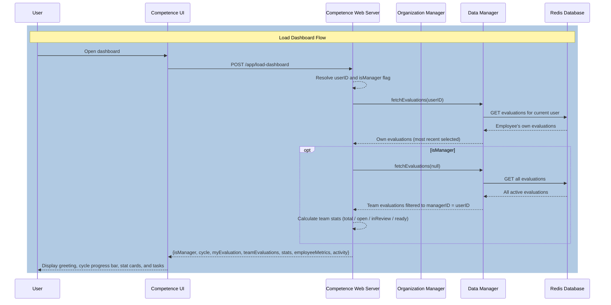

### Load Employee List

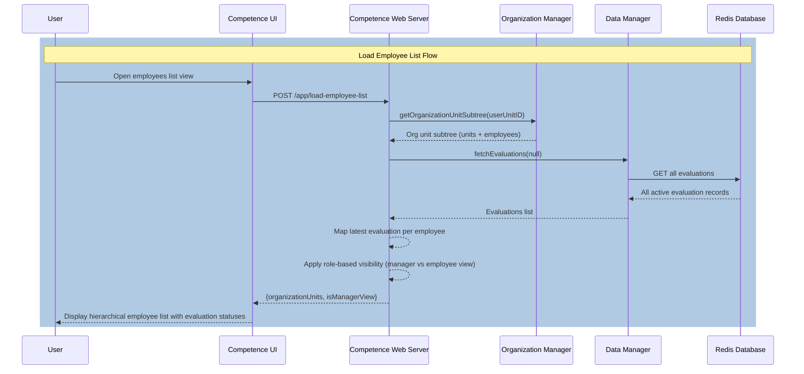

### Load Evaluation

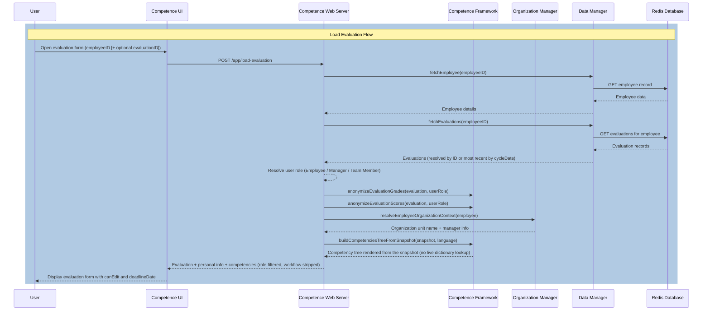

### Load New Evaluation Data

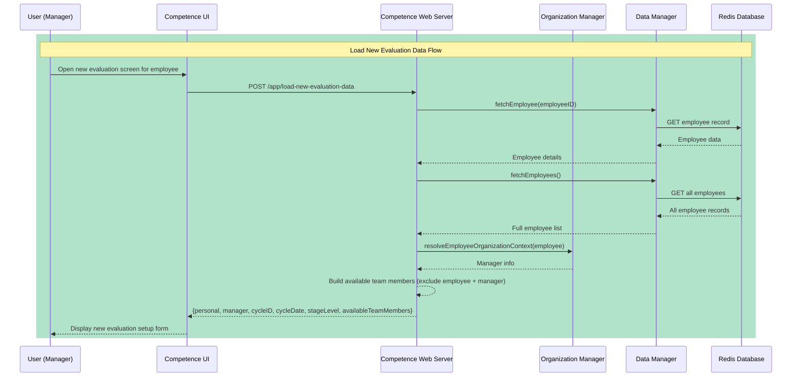

### Save Evaluation Draft

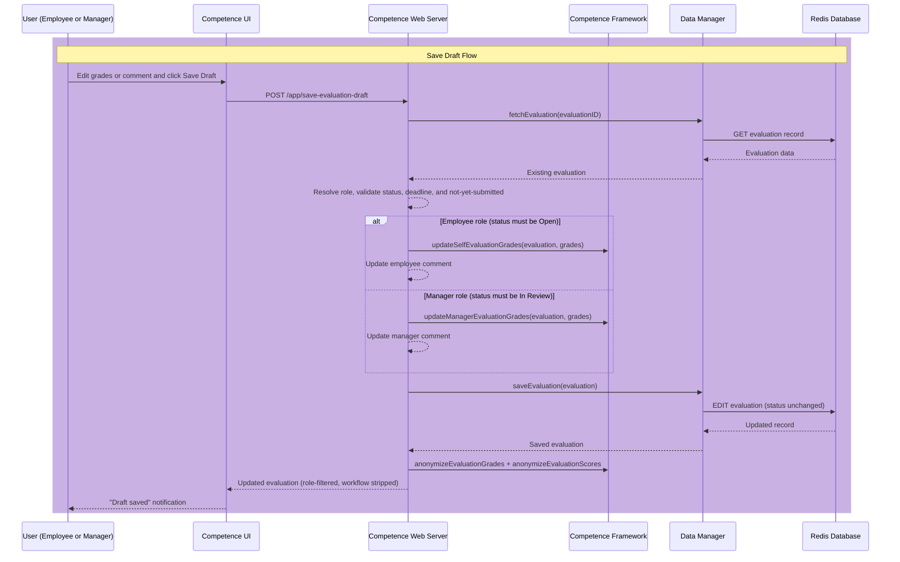

### Submit Evaluation

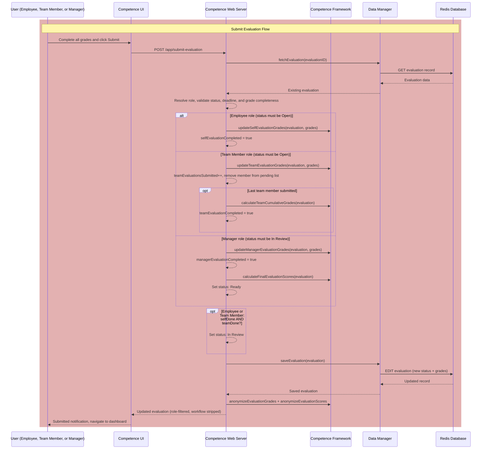

### Load Manager Calendar

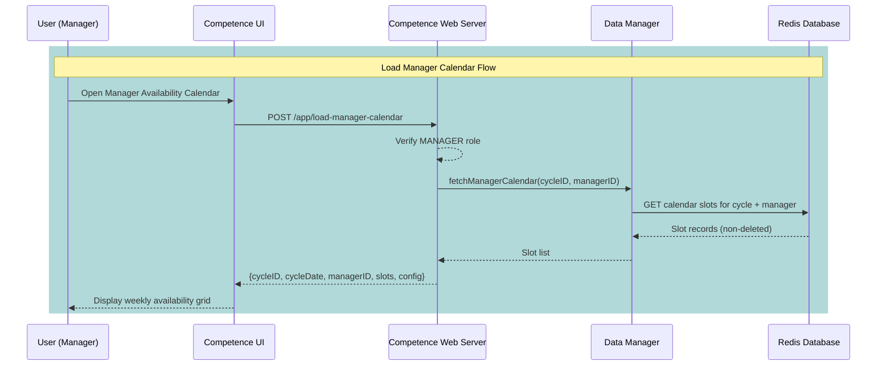

### Toggle Calendar Slot

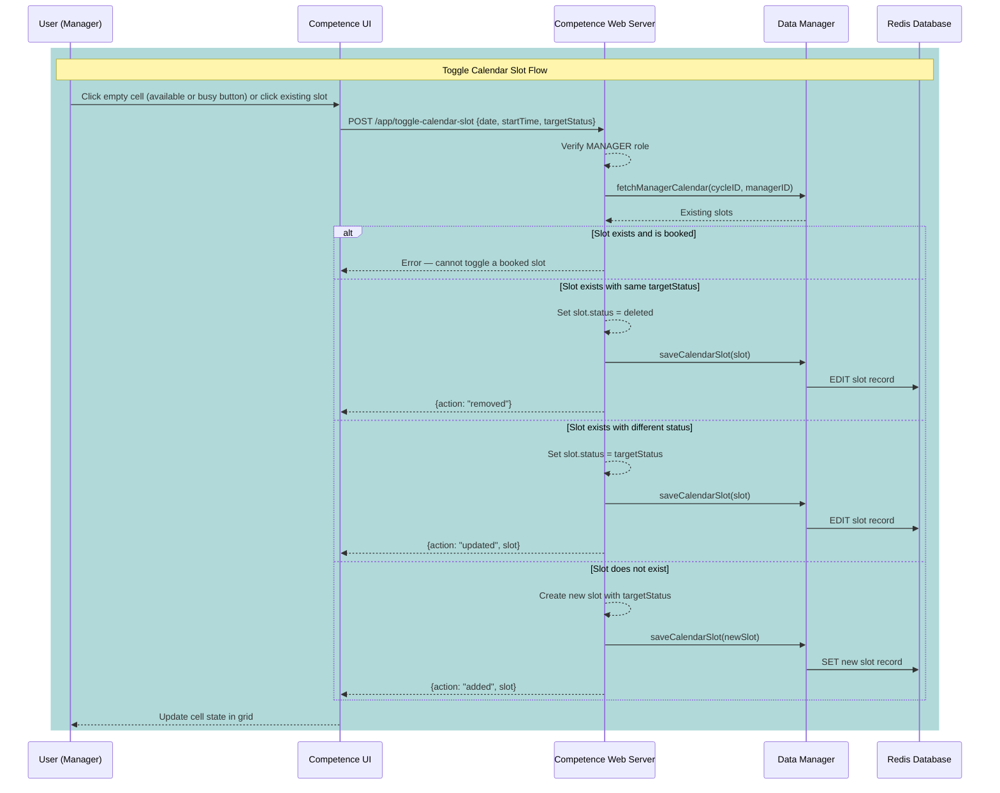

### Load Interview Schedule

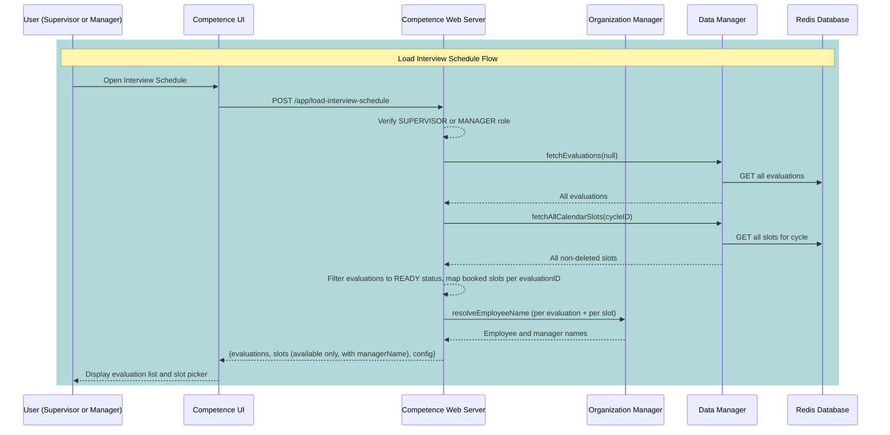

### Book Interview Slot

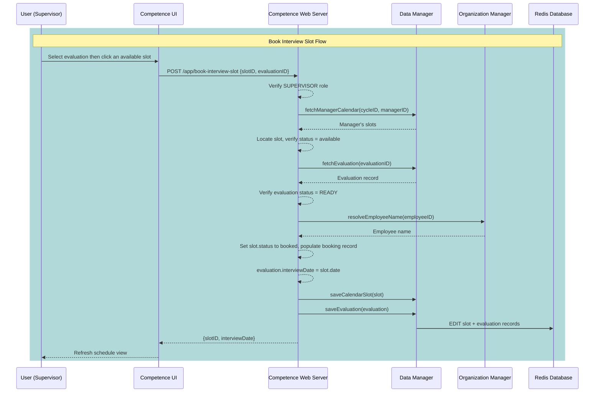

### Cancel Interview Booking

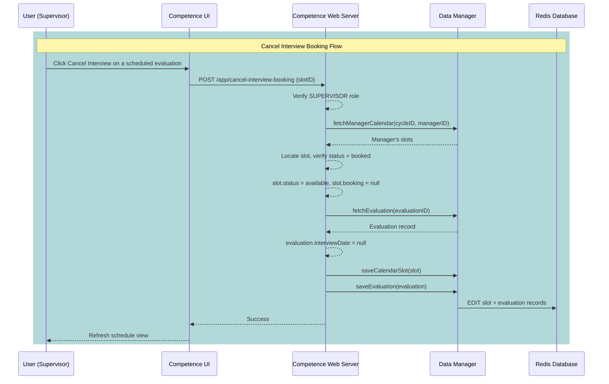

### Start Evaluation

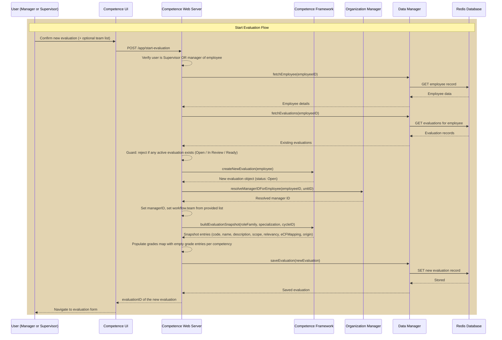

---

## Configuration Reference

### Configuration Files

All configuration lives in `bin/config/` as JSON, validated against the schemas in `bin/data/schemas/`. The editable documents are registered with the framework's admin config registry and can be changed through the Administration screens; localization for every user-visible string is in `bin/localization/competence-labels.json`.

| File                                  | Holds                                                                                              | Admin-editable                |
|---------------------------------------|----------------------------------------------------------------------------------------------------|-------------------------------|
| `config.application.json`             | App settings — evaluation/grade weights, performance thresholds, active-set cap, interview calendar | No                            |
| `config.role-families.json`           | The nine role families and their permitted specializations                                         | Yes (text + specializations)  |
| `config.competencies.json`            | The competency dictionary (108) — category, subcategory, scope anchors, archetype assignment, e-CF  | Yes                           |
| `config.relevancy-archetypes.json`    | The seven relevancy archetype curves (twelve stage-level weights each)                              | Yes                           |
| `config.role-family-competencies.json`| The per-family competency pool (applicability universe)                                            | No (read-only; exportable)    |
| `config.active-competency-sets.json`  | Per-cycle baseline + specialization competency selections                                          | Yes                           |
| `config.stage-levels.json`            | The stage-level ladder (N/J/R/S/X/T and their stage counts)                                         | No (read-only)                |
| `config.organization-structure.json`  | The organization chart (units + employees) used to resolve managers                                | No                            |

The competency dictionary, the relevancy archetypes, and the per-family pool are generated from the source-of-truth design documents in `design/` by `bin/build/build-competency-relevancy.js`; hand-edit those documents and re-run the build rather than editing the generated files directly.

### Application Settings

All application settings are in `bin/config/config.application.json` and are validated against a JSON schema on startup.

| Setting                                                       | Default       | Description                                                                         |
|---------------------------------------------------------------|---------------|-------------------------------------------------------------------------------------|
| `performanceAppraisals.evaluationWeights.self`                | `0.20`        | Weight of self-evaluation in the final score                                        |
| `performanceAppraisals.evaluationWeights.team`                | `0.30`        | Weight of team evaluation in the final score                                        |
| `performanceAppraisals.evaluationWeights.manager`             | `0.50`        | Weight of manager evaluation in the final score                                     |
| `performanceAppraisals.gradeWeights.S`                        | `1.3`         | Numeric weight for grade S (Superior)                                               |
| `performanceAppraisals.gradeWeights.R`                        | `1.0`         | Numeric weight for grade R (Regular)                                                |
| `performanceAppraisals.gradeWeights.U`                        | `0.6`         | Numeric weight for grade U (Unsatisfactory)                                         |
| `performanceAppraisals.gradeWeights.N`                        | `0.0`         | Numeric weight for grade N (Not Utilized)                                           |
| `performanceAppraisals.isTeamEvaluationCollective`            | `true`        | If `true`, team members grade by subcategory; if `false`, by individual competency  |
| `performanceAppraisals.minTeamEvaluationMembers`              | `3`           | Minimum number of team members required to start a peer evaluation (enforced)       |
| `performanceAppraisals.maxTeamEvaluationMembers`              | `5`           | Maximum number of team members allowed per evaluation (enforced; `null` = no limit) |
| `performanceAppraisals.activeCompetencySetCap`               | `30`          | Maximum competencies in a resolved active set (baseline ∪ specialization); a ceiling enforced at cycle lock. There is no minimum count (see [Active Competency Set](#role-families-and-specializations)) |
| `performanceAppraisals.numberOfNextPeriodGoals`               | `5`           | Maximum number of goals for the next period *(planned feature)*                     |
| `performanceAppraisals.performanceThresholds.T1`              | `76`          | Score ceiling for T1 (Weak)                                                         |
| `performanceAppraisals.performanceThresholds.T2`              | `89`          | Score ceiling for T2 (Insufficient)                                                 |
| `performanceAppraisals.performanceThresholds.T3`              | `105`         | Score ceiling for T3 (Expected)                                                     |
| `performanceAppraisals.performanceThresholds.T4`              | `119`         | Score ceiling for T4 (Good)                                                         |
| `performanceAppraisals.performanceThresholds.T5`              | `150`         | Score ceiling for T5 (Outstanding)                                                  |
| `performanceAppraisals.interviewCalendar.slotDurationMinutes` | `30`          | Duration in minutes of each calendar slot                                           |
| `performanceAppraisals.interviewCalendar.workingHoursStart`   | `"09:00"`     | First slot start time (HH:MM, local time)                                           |
| `performanceAppraisals.interviewCalendar.workingHoursEnd`     | `"18:00"`     | No slot may start at or after this time (HH:MM, local time)                         |
| `performanceAppraisals.interviewCalendar.workingDays`         | `[1,2,3,4,5]` | Working days shown in the calendar grid (0 = Sunday … 6 = Saturday)                 |

### Environment Variables

| Variable                  | Default | Description                                                                                                                       |
|---------------------------|---------|-----------------------------------------------------------------------------------------------------------------------------------|
| `COMPETENCE_PRELOAD_DATA` | `false` | If `true`, seeds employee and evaluation data from `bin/data/seeders/` into Redis on startup (useful for development and testing) |

This is the only application-specific variable. The standard `@ti-engine/core` and `@ti-engine/web-framework` variables also apply — service identity (`TI_INSTANCE_NAME`, `TI_INSTANCE_CLASS`), the Redis connection (`TI_MEMORY_CACHE_HOST`/`PORT`/`AUTH`/`DB`), logging, and the web/auth settings — and are loaded from the package `.env` via dotenvx. The administrator allowlist (`auth.admins`) and the authentication methods are configured in the web server's JSON config, not through environment variables.
